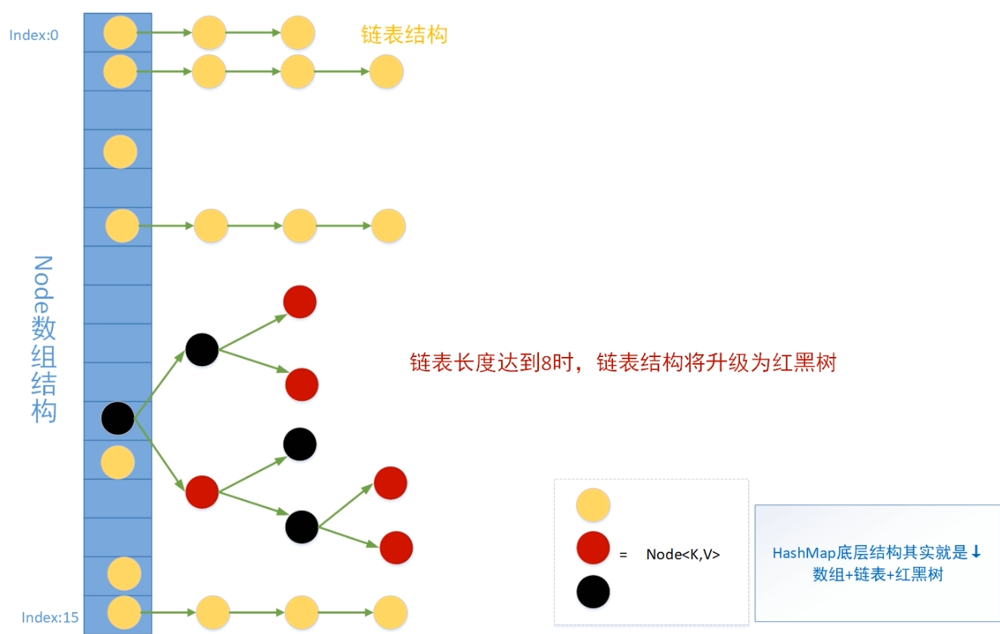

#  HashMap继承体系


```java
static class Node<K,V> implements Map.Entry<K,V> {
        final int hash;
        final K key;
        V value;
        Node<K,V> next;

        Node(int hash, K key, V value, Node<K,V> next) {
            this.hash = hash;
            this.key = key;
            this.value = value;
            this.next = next;
        }

        public final K getKey()        { return key; }
        public final V getValue()      { return value; }
        public final String toString() { return key + "=" + value; }

        public final int hashCode() {
            return Objects.hashCode(key) ^ Objects.hashCode(value);
        }

        public final V setValue(V newValue) {
            V oldValue = value;
            value = newValue;
            return oldValue;
        }

        public final boolean equals(Object o) {
            if (o == this)
                return true;
            if (o instanceof Map.Entry) {
                Map.Entry<?,?> e = (Map.Entry<?,?>)o;
                if (Objects.equals(key, e.getKey()) &&
                    Objects.equals(value, e.getValue()))
                    return true;
            }
            return false;
        }
    }
```



外层Node长度为16，当链表长度大于达到8且hash中所有元素达到64个，链表会升级为红黑树。

# map.put()  流程

1. map.put(key,value)  map.put("tkey", "tv") 

2. 获取key的hash值    
3. 经过hash值扰动函数，使此hash值更散列
4. 构造Node对象  Hash-> 1122, Key-> "tkey", Value->"tv", Next-> null
5. 路由算法，找出node应存放的数组的位置

> 路由寻址公式   (table.length - 1) & node.hash   // table.length一定是2的次幂
>
> (16 - 1) & 1122 => 0000 0000 1111 & 0100 0110 0010 => 0010 => 2  将此次的值放在index为2的位置

**HashMap第层结构其实就是 数组+链表+红黑树**

Hash碰撞指的是不同的key被映射到相同的位置，hashMap使用链表连接这些碰撞值，当碰撞非常严重时，查询效率由O(1) 退化为 O(n)

引入红黑树（自平衡的二叉查找树） 的目的就是解决链化严重的问题。

# HashMap扩容原理

hash数组太小，链化严重，查询效率退化为O(n)，为了解决哈希冲突导致的上述问题，扩容会缓解，以空间换时间。


# 源码分析

`put`、`resize`、`get`、`remove`、`replace`

##  核心元素

```java
// 缺省table大小  16
static final int DEFAULT_INITIAL_CAPACITY = 1 << 4; // aka 16
// table最大长度
static final int MAXIMUM_CAPACITY = 1 << 30;
// 负载因子大小
static final float DEFAULT_LOAD_FACTOR = 0.75f;
// 树化阈值 8，链表长度超过8，链表会被升级成树
static final int TREEIFY_THRESHOLD = 8;
// 树降级成链表的阈值
static final int UNTREEIFY_THRESHOLD = 6;
// hash表中元素超过64且某个链上元素超过8，才会树化
static final int MIN_TREEIFY_CAPACITY = 64;

// Node数组构建的 Hash表
// 什么时候初始化？put第一个元素的时候
transient HashMap.Node<K,V>[] table;
// 当前hash中元素个数
transient int size;
// 当前哈希表中结构修改次数，导致结构变化的修改
transient int modCount;
// 扩容阈值， 当哈希表中的元素超过阈值时，会触发扩容
int threshold;
// 负载因子
// 计算threshold  = capacity * loadFactor
final float loadFactor;

```

##  构造方法（其中一个）

```java
public HashMap(int initialCapacity, float loadFactor) {
// 校验：0 < initialCapacity <  MAXIMUM_CAPACITY; 
        if (initialCapacity < 0)
            throw new IllegalArgumentException("Illegal initial capacity: " +
                    initialCapacity);
        if (initialCapacity > MAXIMUM_CAPACITY)
            initialCapacity = MAXIMUM_CAPACITY;
    // 校验：loadFactor > 0
        if (loadFactor <= 0 || Float.isNaN(loadFactor))
            throw new IllegalArgumentException("Illegal load factor: " +
                    loadFactor);
    
        this.loadFactor = loadFactor;
    // tableSizeFor() 返回一个大于等于initialCapacity的2的次幂数
        this.threshold = tableSizeFor(initialCapacity);
    }
/**
* tableSizeFor() 返回一个大于等于initialCapacity的2的次幂数
* 任何一个十进制数，转换为二进制，
* 函数返回结果是 从最高位1开始，所有位全部变为 1，最后再 +1 （即进位变为2的次方数）输出
*/
// 用实际例子可以测试，如 10 可以得到 16
static final int tableSizeFor(int cap) {
        int n = cap - 1; // 若跳过，得到结果会 *2 
        n |= n >>> 1;
        n |= n >>> 2;
        n |= n >>> 4;
        n |= n >>> 8;
        n |= n >>> 16;
        return (n < 0) ? 1 : (n >= MAXIMUM_CAPACITY) ? MAXIMUM_CAPACITY : n + 1;
    }
```

```java
/*
*  作用： 在table长度不大得时候 让key的hash值得高16位也参与路由运算
*  h = 0b 0010 0101 1010 1100 0011 1111 0010 1110
*  0b 0010 0101 1010 1100 0011 1111 0010 1110
*  ^
*  0b 0000 0000 0000 0000 0010 0101 1010 1100
*  => 0010 0101 1010 1100 0001 1010 1000 0010
*/
static final int hash(Object key) {
    int h;
    return (key == null) ? 0 : (h = key.hashCode()) ^ (h >>> 16);
}
```

