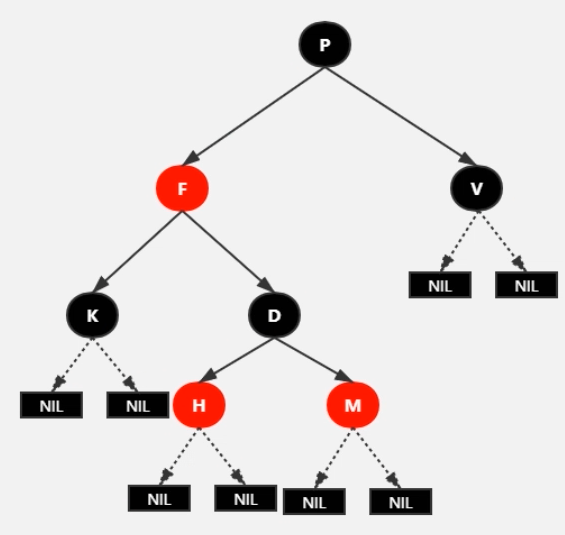
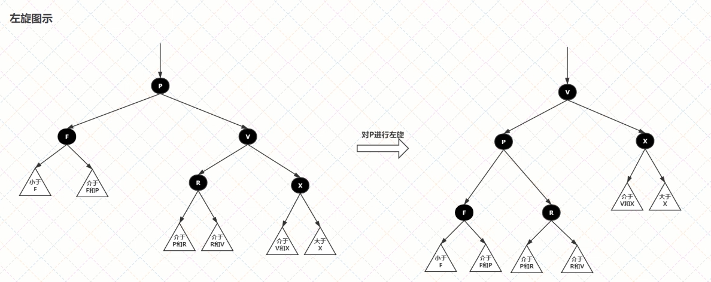
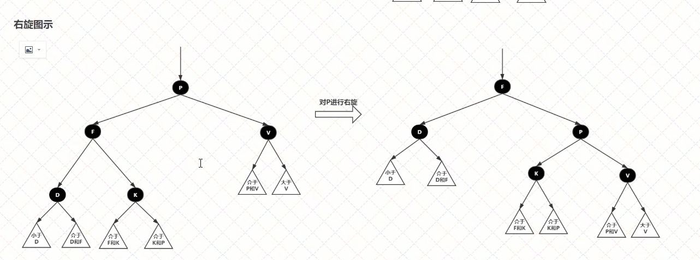
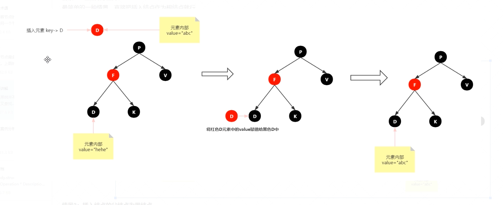
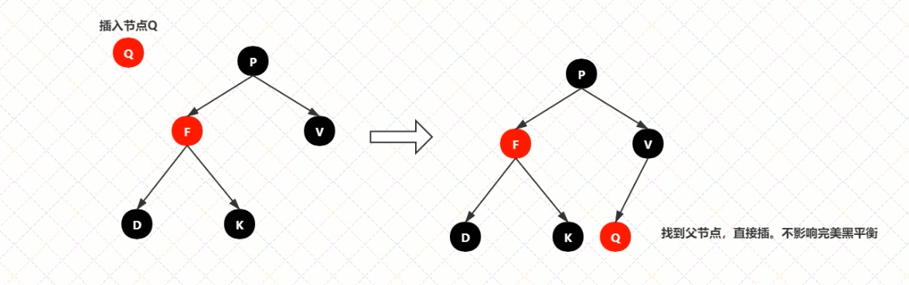

 为什么有了平衡二叉树（AVL）之后还需要红黑树？

虽然AVL解决了二叉树退化为近似链表的缺点，能够把查找时间控制在O(logn)，但却不是最佳的。

原因：AVL要求每一个结点的左右子树高度差不超过1，导致每次插入/删除时几乎都会破坏AVL的平衡规则，进而需要通过左旋、右旋来调整树使之平衡。

如果在插入、删除很频繁的场景中，AVL频繁调整会使其性能大打折扣，为了解决性能问题，引入红黑树。

#  红黑树的性质

1. 每个节点要么是黑色，要么是红色；

2. 根节点是黑色；

3. 每个叶子节点（NIL）是黑色；

4. 每个红色节点的两个子节点一定都是黑色，不能有两个红色节点相连；

5. 任意一节点到每个叶子节点的路径都包含数量相同的黑节点，称**黑高**；

   5.1 如果一个节点存在黑子节点，那么该节点肯定有两个子节点。

红黑树并不是一个完美平衡的二叉查找树，上图中P的左子树显然比右子树高，但左子树和右子树的黑节点层数是相等的，即任意一个节点到每个叶子节点的路径都包含数量相同的黑节点。所以红黑树的这种平衡叫做**黑色完美平衡**。

#  操作

1. **变色**： 节点颜色由红变黑或由黑变红；
2. **左旋**： 以某个节点作为支点（旋转节点），其右子节点变为旋转节点的父节点，右子节点的左子节点变为旋转节点的右子节点，左子节点保持不变；
3. **右旋**： 以某个节点作为支点（旋转节点），其左子节点变为旋转节点的父节点，左子节点变为旋转节点的左子节点，右子节点不变。

#  查找与插入

##  查找

与二叉查找树类似

##  插入

1. 查找要插入的位置（一定是红插，否则一定会破坏红黑树性质）
2. 插入后自平衡

#  情景分析

##  红黑树为空树

最简单的一种情景，直接把插入节点作为根节点就行

注意：根据红黑树性质2，根节点是黑色，还需要把插入节点设为黑色。

##  插入节点的Key已存在

处理：更新当前节点的值，为插入节点的值

##  插入节点的父节点为黑节点

由于插入的节点是红色，当插入节点是黑色时，并不会影响红黑树的平衡，直接插入即可，无需做自平衡。

##  插入节点的父节点为红色

性质2：根节点是黑色。如果插入节点的父节点为红节点，那么该父节点不可能为根节点，所以插入节点总是存在祖父节点。这一点很关键，因为后学的旋转操作肯定需要祖父节点的参与。

